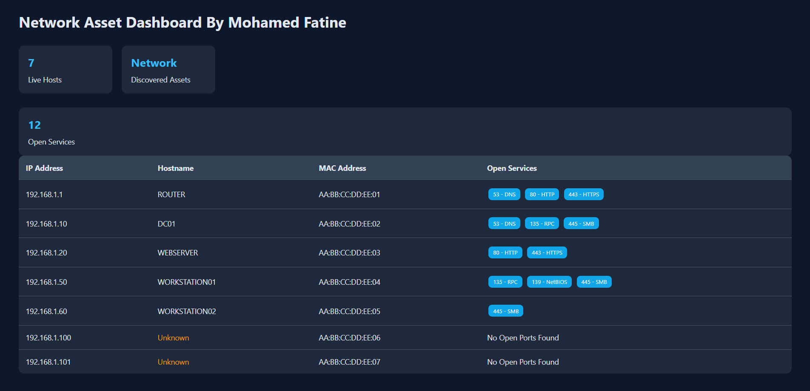

# Network Asset Discovery Dashboard

A Flask-based network asset discovery dashboard that performs host discovery, service enumeration, MAC address identification, and visualizes network assets through a web interface.

## Features

* ICMP Host Discovery (Ping Sweep)
* Hostname Resolution
* TCP Port Scanning
* Service Detection
* MAC Address Discovery
* Multithreaded Scanning
* JSON Reporting
* Flask Web Dashboard
* Network Asset Visualization

## Technologies Used

* Python
* Flask
* Socket Programming
* Scapy
* ThreadPoolExecutor
* HTML/CSS
* JSON

## Dashboard Features

* Live host count
* Open service count
* Asset inventory table
* Hostname identification
* MAC address visibility
* Service enumeration display

---

## Dashboard Preview

<p align="center">
  
</p>

---

## Usage

Run the scanner:

```bash
python scanner.py
```

Run the dashboard:

```bash
python app.py
```

Open:

```text
http://127.0.0.1:5000
```

## Project Structure

```text
Network-Device-Scanner/
│
├── scanner.py
├── app.py
├── templates/
│   └── index.html
├── sample_scan_results.json
├── README.md
└── .gitignore
```

## Disclaimer

This project is intended for educational purposes and authorized network assessment only.
